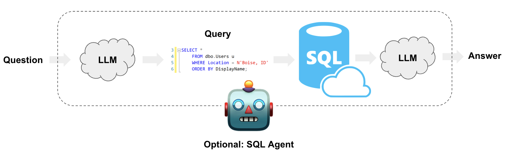

# Agent-AI-Q-A-system
Agent AI for Q&amp;A about database information. It is based in LLMs, LangChain tools and OpenAI.
You need a Postgres database with one or more tables and credential to access to Postgres Database.

# Questions example
Give me all title order by asc
what is the most old movie?
what is the most recent movie?
what movie was writer by "James Gunn"?
Give me all data of movies table
Give me all data of movies table as csv format

## Run Locally

Clone the project

```bash
  git clone https://github.com/aliexerleo/agent-AI-Q-A-system.git
```

Go to the project directory

```bash
  cd /agent-AI-Q-A-system
```

Create environment

```bash
  python3 -m venv venv
```

Install dependencies

```bash
  pip install -r requirements.txt
```

Start the server

```bash
  streamlit run app.py
```

## Architecture




## Documentation

[LangChain](https://python.langchain.com/v0.2/docs/tutorials/sql_qa/)


## 🚀 About Me
I'm a NLP Engineer and AI developer...

## Authors

- [@aliexerleo](https://github.com/aliexerleo)